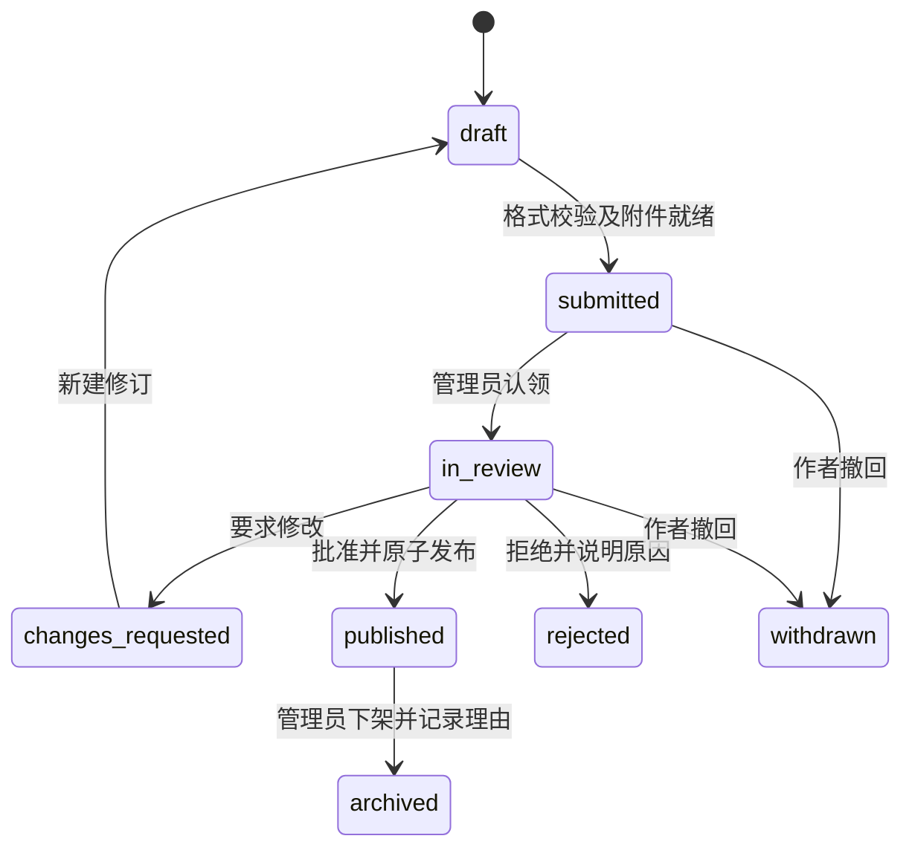

# Fracture Atlas 社区提交与审核设计

日期：2026-10-03。状态：设计提案，尚未实现或配置外部服务。

本轮仅制定计划。默认采用本文推荐项，不需要用户逐项确认。未来实施按独立功能验证、commit；开通服务、配置实际账号与凭证属于实施阶段。

## 1. 推荐方案与首版边界

保留 React + Vite + GitHub Pages，新增 Supabase Auth、Postgres、私有 Storage 和少量 Edge Functions。GitHub Pages 发布前端；Supabase 保存用户、社区资料、审核记录和附件。审批通过后直接更新社区查询结果，不触发 GitHub commit 或网站重建。

首版提供：GitHub 登录、三类提交、云端草稿、模板导入、附件上传、我的提交、管理员审核、社区目录和结果比较。先邀请少量研究者试用，再开放注册提交。

首版不包含：执行用户代码、托管大型数据集或模型权重、自动跑实验、自动授予复现认证、付费、评论系统、复杂组织权限。代码及完整数据集通过仓库/长期存档链接提供。

论文快照继续由 `public/data/study.json` 和原 PDF 提供。社区内容使用独立数据层，明确显示 Community；当前论文里的 16 个 benchmark 和结论不因社区审批自动改变。

## 2. 现有代码的接入位置

| 现状                                               | 实施时的调整                                                                                                  |
| -------------------------------------------------- | ------------------------------------------------------------------------------------------------------------- |
| `src/App.tsx` 用 hash 路由                         | 保留，新增 Community、Submit、账户、审核路由                                                                  |
| 整个 App 在论文快照读取完成前不显示页面            | 提取 AppShell、PaperDataBoundary；登录、提交、社区不依赖论文数据加载                                          |
| `src/data.ts` 硬编码 BENCHMARKS / METHODS / MODELS | 保留给论文页面；新增独立社区类型、查询和注册表，不直接往常量追加用户数据                                      |
| 方法颜色与形状固定五种                             | 社区方法归入 ICL / SkillOpt / SFT / RL / TTT / Other 家族，具体方法仍有独立版本；Other 用暖灰六边形与明确名称 |
| Overview 对通用任务采用百分数轴                    | 不直接复用给任意社区指标；社区图表按协议、单位、上下界和方向配置                                              |
| `.github/workflows/deploy-pages.yml` 发布静态 dist | 继续使用，构建注入后端公开配置；后端迁移另走受控流程                                                          |
| 现有明暗主题及 Aetherheart 署名                    | 所有新页面复用主题；提交/管理界面背景保持静态                                                                 |

建议目录：`src/community/{types,api,validation}`、`src/auth/`、`src/pages/community/`、`src/pages/submissions/`、`src/pages/admin/`、`supabase/migrations/`、`supabase/functions/`。这是未来目录设计，本轮不创建这些功能文件。

## 3. 信息架构与页面

为避免现有导航拥挤，桌面主导航调整为：Overview / Explore / Community / Paper & resources，右侧 Submit、登录头像和主题切换。Explore 菜单包含现有 Results、Benchmarks、Costs、Diagnostics；原 URL 保留，旧链接不失效。移动端折叠菜单。管理员在账户菜单看到 Review queue。

| 路由（均位于 `#/` 下）       | 用途                                                          |
| ---------------------------- | ------------------------------------------------------------- |
| `community`                  | Benchmarks / Methods / Results 三个标签，检索、筛选和最近发布 |
| `community/benchmarks/:slug` | 说明、数据来源、协议版本、对应公开结果                        |
| `community/methods/:slug`    | 方法、家族、版本、论文/代码、对应结果                         |
| `community/results/:id`      | 原始成绩、成本、协议、证据与版本历史                          |
| `submit`                     | 选择 Result / Benchmark / Method，Result 作为常用入口         |
| `submissions/:id/edit`       | 分步编辑草稿、导入、上传和预览                                |
| `account/submissions`        | 自己的草稿、状态、修改要求与已发布版本                        |
| `submissions/:id`            | 提交详情、可见的审核意见、版本时间线                          |
| `admin/reviews`              | 按状态/类型筛选，认领、排序、待办计数                         |
| `admin/reviews/:id`          | 核对证据、查看修订差异、预览、作出决定                        |
| `account/security`           | 登录信息；管理员配置第二因素                                  |

提交页桌面布局：顶部步骤条；左侧约 2/3 为表单，右侧约 1/3 为字段说明/当前预览。手机端改为单列。保存成功显示时间，失败明确标为未保存；切步骤和离开页面时处理未保存状态。

```text
Submit a contribution
[Result]  [Benchmark]  [Method]

1 基本信息 → 2 协议与数据 → 3 证据材料 → 4 预览并提交

表单与逐字段错误                  提交后将显示的卡片/图表预览
选择已有 benchmark/method        当前公开信息范围
或保存草稿后提出新条目申请        缺少的必填项

[保存草稿]                       [上一步] [继续 / 提交审核]
```

管理员详情桌面三栏：左侧提交概览和历史，中间字段/差异/证据，右侧审核清单与决定。小屏上下排列。危险操作不只靠颜色区分。

## 4. 三类提交与表单内容

### Benchmark

必填：名称、简述、任务类别、数据集版本与 split、原始来源 URL、数据使用许可说明、评测协议版本、指标名称/单位/优化方向、评分脚本或评测器说明。指标边界可未知，但必须显式选择未知；不默认 0–100。

可选：样本量、语言、论文、代码、示例、限制。无结果的新 benchmark 可以单独公开，显示“暂无已审核结果”。不把原始样本、医学记录等敏感数据作为提交要求。

协议是独立版本：数据版本、split/subset、指标定义和归约方式、评测器/脚本版本、提示或工具约束、样本数。修改其中影响比较的字段必须产生新协议版本。

### Method

必填：名称、方法家族、版本、简述、配置说明、可追溯的论文或代码/方法文档链接、适用模型/任务条件。所属机构与贡献者展示信息由用户明确填写，不由登录邮箱推断。

代码 commit/tag、超参数、优化预算、teacher、训练/测试阶段信息按适用性填写。方法登记本身不构成效果验证。

### Result

选择已批准的 benchmark 协议与方法版本，填写模型精确 ID/版本、运行日期、分数、样本数、运行配置/来源。可选提供匹配 baseline、重复次数、方差/置信区间及其含义、计算硬件、费用组成与证据。

模型配置含适用的精度/量化、上下文、解码设置、工具环境；不适用时明确标注。闭源模型无法提供精确版本时保留原始名称和日期，比较时提示限制。

首版不另设“提交模型”入口：结果表单可选已有模型版本或填写新版本提议。新模型元数据随结果一起审核，批准事务去重并创建版本；作者填写的同名模型不自动视为同一版本。初始 benchmark/method/model 注册表从已确认的论文元数据导入；源快照中缺少的协议字段标为未知，不据此自动宣称社区结果可比。

若 benchmark 或 method 尚不存在：可在结果草稿中关联自己的待审申请，但结果必须等依赖项批准并锁定版本后才能正式送审；页面明确显示阻塞原因，不默默替换引用。

原始结果附件允许结构化 JSON/CSV 导入，前端预览，服务端重新验证。每个结果提交首版只对应一个实验/协议；CSV 可含该实验多次重复运行，最多 1,000 行。不首发跨 benchmark 批量发布。

## 5. 状态、版本与审核语义



`published` 本身即审核批准后公开，首版不增加一个容易滞留的 approved-but-unpublished 状态。提交给审核的 revision 永远不可改；退回后复制新草稿 revision。普通草稿可反复保存，但使用 `lock_version` 防止两个标签页互相覆盖。

已发布条目的更新是一个新 submission，指向原条目及原版本。审批新版本后切换 current revision；旧版本仍可追溯。审核中原公开内容不变。基于旧版本的更新审批若遇到另一版本先发布，返回冲突，需重新核对差异。

公开证据标签：

- **Community · Reviewed**：管理员审查了资料完整性、协议和证据，不表示实测验证。
- **Community · Reproduced**：指定管理员记录复现环境、协议、结果和证据后，单独授予。
- **Paper snapshot**：当前论文原始快照来源。

管理员核对：来源可追溯、名称不重复、指标/分母清楚、版本一致、费用口径、公开字段/附件范围、是否可比较。请求修改、拒绝、下架必须写理由。作者可看处理意见，内部备注只供管理员。

默认不允许审核自己的提交；先配置两名公司审核员。只有一名管理员时，自己的申请保持待审，而不是静默绕过规则。管理员授权与撤销由项目所有者通过受控运维步骤完成，首版不提供网页任意提权。

## 6. 数据模型与公开数据边界

用规范化公开实体承载检索/图表；草稿 payload 用带 schema_version 的 JSONB 适应表单。避免用一张任意 JSON 表同时充当草稿、审核记录和公开 API。

| 表/资源                                    | 关键内容                                                                                  |
| ------------------------------------------ | ----------------------------------------------------------------------------------------- |
| `auth.users`                               | Supabase 登录身份；邮箱不复制到公开资料                                                   |
| `profiles`                                 | 用户展示名、可选机构、公开主页；不含审核权限                                              |
| 私有 `app_roles`                           | user_id、reviewer/admin、授权记录；仅受控后台写入                                         |
| `submissions`                              | owner、type、target_entity、base_revision、状态、current_revision、reviewer、lock_version |
| `submission_revisions`                     | submission_id、revision_no、schema_version、payload、校验结果、sealed_at                  |
| `attachments`                              | revision、不可变对象路径、hash、大小、类型、上传/校验状态、公开意向                       |
| `review_events`                            | actor、revision、决定、公开意见/私有备注、时间；只追加                                    |
| `benchmarks` / `benchmark_versions`        | 稳定 ID、slug、各版内容、当前公开版                                                       |
| `protocol_versions` / `metric_definitions` | benchmark 版本、评测条件、指标方向/单位/界限、归约和比较条件                              |
| `methods` / `method_versions`              | 稳定 ID、slug、家族、代码版本、配置                                                       |
| `models` / `model_versions`                | 模型原始 ID、归一化名称、版本与修订、精度等信息                                           |
| `results` / `result_versions`              | 精确外键、成绩、匹配 baseline、样本与运行信息、费用、来源和发布状态                       |
| `reproduction_checks`                      | 官方复现的操作者、环境、证据和结论；独立于审批                                            |
| `notifications`                            | 用户可见的状态变化通知；站内为首版默认                                                    |
| 私有 `operation_keys` / 配额记录           | 幂等键、请求摘要、提交/附件配额，不暴露客户端写权限                                       |

外键指向不可变版本 ID，不只指向会变化的名字。全站 slug 由服务端分配并检测冲突；审核可合并到已存在的实体，但有影响的重映射应退回作者确认修订。

公开 API 使用仅包含批准字段的投影/视图：不返回邮箱、待审 payload、管理员备注、私有附件路径。底层发布状态过滤仍由 RLS 执行，视图采用 security_invoker 或等价严格权限边界，防止视图绕过底表权限。

审核与发布在单个数据库事务里完成：锁定 submission、校验管理员/状态/版本/依赖和附件、插入不可变公开版本、切换当前版本、记录 review_event、插入站内通知、更新状态。双击或重试使用幂等键；两个管理员并发批准只允许一个成功。

## 7. 认证与权限

推荐 GitHub OAuth 单入口，符合研究与开源用户群。只用登录所需权限，不申请仓库写权限；首版不接管用户仓库。PKCE 回调返回真实存在的 `/Fracture-Atlas/` 根路径，在路由初始化前处理 `?code=`，完成后清除认证参数，转到允许列表中的站内 hash 路由。这样避免 `#/...` 与 OAuth 回调参数冲突，也不要求 GitHub Pages 支持服务端路由。

处理取消登录、失效 code、重复回调、缺失 verifier、刷新和多标签登录冲突。登录失败可以重试，不丢已保存草稿。Supabase 回调白名单精确配置生产与本地地址，不使用生产通配回调。

| 操作            | 游客 | 普通用户           | 审核管理员           |
| --------------- | ---- | ------------------ | -------------------- |
| 阅读公开记录    | 是   | 是                 | 是                   |
| 读写草稿/上传   | 否   | 仅自己且可编辑状态 | 不能替作者静默改内容 |
| 查看待审材料    | 否   | 仅自己的申请       | 是，按审核权限       |
| 改审核状态/发布 | 否   | 否                 | 仅经审批接口         |
| 赋予管理员权限  | 否   | 否                 | 首版不在网页提供     |
| 读内部备注      | 否   | 否                 | 是                   |

所有表配置显式 grants + RLS；作者不能通过直接 PATCH 把状态改为 published、换 owner、改 reviewer，角色不存于可自行编辑的 user_metadata。敏感状态转换经数据库函数完成，函数固定 search_path、最小执行授权，并校验调用者。Edge Function 若用高权限客户端，必须先验证会话和当前角色；不信任 body 中的 user_id/admin 字段。

管理员读取审核材料和执行审批要求第二因素会话；审批事务重新查询实时角色，防止已撤销角色仍靠旧 JWT 审批。前端隐藏 admin 入口只是 UX，不是权限边界。

浏览器只持有 Supabase URL 和 publishable key。secret/service_role key、数据库密码、OAuth client secret 绝不放入 Vite 环境变量或 Pages 产物。

## 8. 附件、校验和防滥用

推荐初始产品限制（不是服务商配额承诺）：每次提交最多 5 个附件、单个 10 MB、合计 25 MB；JSON/CSV 导入最多 2 MB / 1,000 行；每用户每天最多正式送审 5 次、最多 10 个待处理申请。草稿保存不计入送审次数，但有独立请求限流。

附件格式先支持 JSON、CSV、PDF、PNG、JPEG；代码、HTML、SVG、压缩包、模型权重和大数据集提供链接。服务端校验扩展名、内容类型、实际大小及文件头；结构化数据使用固定 schema，不执行上传内容。

所有附件放私有 bucket。上传过程：先建立名额/元数据记录 → 生成随机对象路径及短期上传授权 → 文件上传 → 服务端确认大小/hash/类型 → 标记 ready。对象不允许 overwrite/upsert；提交送审后禁止增删换文件。变更附件必须新 revision + 新对象路径。上传和送审配额用数据库原子计数，不能只在前端计数。

证据不因发布自动公开。作者明确选择允许公开的材料，管理员批准时逐个确认；公众下载接口仅为当前可公开版本的批准附件签发短期 URL，私有证据仅作者和审核员可读。正文图表不直接嵌入用户 HTML/SVG；Markdown 禁止原始 HTML，URL 限 http(s)。首版不由服务器自动抓取任意外链，避免把链接预览变成任意网络访问。

PDF 作为下载材料处理，界面不默认内联执行/加载第三方活动内容；图像服务端解码重编码后再预览。推荐独立隔离的 ClamAV worker 扫描文件，通过任务接口接入，不把文件扫描塞进浏览器或短时 Edge Function。扫描服务属于可替换的部署依赖，不改变主数据架构；扫描中、失败或服务尚未配置的文件不能供公众下载，限制格式本身不声称等于安全扫描。试运行可先只公开结构化结果与原始论文/仓库链接，不以跳过扫描换取附件公开。

未完成上传的孤立对象可在 24 小时后自动清理；扫描失败的对象保留诊断状态但不可下载。保留与删除策略应在上线材料中说明，未确定期限时不静默删除已提交审核证据。

## 9. 科研数据比较规则

首版允许公开结果但不保证每条都可入排行榜。对比组至少固定 benchmark/协议版本、split/subset、指标/归约、评测器及关键评测约束。模型和方法作为比较维度，其他条件不一致时拆组或仅并列展示并标出差异。

- 百分数与 0–1 比例显式转换并保留原始值；不猜单位。
- 未知成绩/成本使用 null，不补零；负数、无穷和超出已知界限在服务端拦截。
- 较低越好按 direction 处理；未知理论上限不显示虚构 100% 进度条。
- Gain 只有匹配 baseline 条件完整时计算，不从任意同名模型的结果相减。
- 花费有币种、计费日期/依据和组成；无可靠 USD 换算时不混入 USD 图。
- 多次运行的 mean/best、样本量、置信区间定义必须保留；不能将 best-of-N 和单次结果当同协议比较。
- 不生成跨任务总排名；结果属于 Community Reviewed 不等于官方复现。
- 同一比较组保留符合条件的所有结果和版本来源，避免默认只显示最高分造成选择偏差。

JSON/CSV 校验、服务端判定及前端预览共享规则版本。提交前预览显示“会公开什么”“能否进入比较组”“缺少哪些信息”。

## 10. API 与可靠性设计

客户端通过 Supabase 读取公开数据和自己的草稿；查询带分页、筛选及稳定排序（时间 + ID）。草稿、提交和管理写入统一调用有参数白名单的命令，避免任意整行更新。

| 命令/接口                            | 职责                                               |
| ------------------------------------ | -------------------------------------------------- |
| `create_draft` / `save_draft`        | 权属检查、schema_version、乐观锁                   |
| `prepare_upload` / `finalize_upload` | 配额、随机对象路径、文件确认/扫描状态              |
| `submit_revision`                    | 重新校验所有字段和附件，封存 revision，幂等送审    |
| `withdraw_submission`                | 仅作者可撤回待审，记录事件                         |
| `claim_review`                       | 分配 reviewer，检测认领冲突                        |
| `decide_submission`                  | approve / request_changes / reject，原子审核与发布 |
| `archive_publication`                | 下架、原因、影响的依赖/比较组重检                  |
| `record_reproduction`                | 附带证据的复现结论，与审核分开                     |
| `get_attachment_url`                 | 基于身份和当前可见性签发短期下载 URL               |

公开实体查询直接走 RLS 保护的只读投影；涉及文件和复杂校验的逻辑放 Edge Functions；一致性和状态转换由事务数据库函数保证。不要在 Edge Function 内用多个独立请求模拟一个发布事务。

首版不用实时 websocket，采用进入页面/窗口重新聚焦刷新与手动刷新；已批准内容下次请求即可看到。失效重试要有界限。网络错误保留草稿和“未保存”状态，不能误报提交成功。

社区服务不可用时：论文首页、现有图表和 PDF 继续工作；Community/Submit 显示独立错误与重试，不把全站变成错误页。后台列表按单条记录错误隔离。

## 11. 部署、环境与运维

本地开发用独立配置；推荐先建 staging 和 production 两个 Supabase 项目，staging 使用合成测试数据。优先选择 Singapore 区域并在实施前实测目标用户的登录、API、文件连通性；这是默认建议，不宣称解决跨地区网络问题。

GitHub Pages 构建只注入 `VITE_SUPABASE_URL`、`VITE_SUPABASE_PUBLISHABLE_KEY` 和 community feature flag。构建失败、后端未配置时，论文区域仍可发布，提交入口给出明确未开放状态。

后端发布流程与静态部署分离：迁移先在 staging 验证 → 生产备份/恢复点 → 向后兼容数据库迁移 → Functions → 前端。禁止在每次普通前端 build 时无条件运行生产 SQL。紧急回退优先关闭提交入口或回退前端；数据库采用后续修复迁移，不直接删除已收集数据。

Git 仓库只保存迁移、schema、函数、配置模板和合成种子数据，不保存用户文件、真实审核记录或服务密钥。安排数据库与附件清单备份，恢复演练必须包含对象存储文件，不能假定数据库备份包含文件内容。

监控关注：提交失败、权限拒绝异常、附件容量、函数错误/延迟、审核积压。日志不记录 token 或完整私有 payload。费用按数据库、文件存储/出站流量、函数调用和可选邮件/扫描服务计量；不在计划阶段承诺永久免费或固定报价，开通时按所选方案核价。

上线需要准备的资源清单（不是本轮提问）：公司控制的 Supabase 项目、GitHub OAuth App、生产回调 URL、至少两名 reviewer 的账户 ID、管理员第二因素、备份/扫描配置。首版仅站内通知，无须先接 SMTP。

## 12. 分阶段实施与独立 commit

| 阶段          | 交付                                            | 验收 / 回退边界                                            |
| ------------- | ----------------------------------------------- | ---------------------------------------------------------- |
| 1. 基础拆分   | AppShell、论文数据边界、社区类型与 feature flag | 原六页面、PDF 和数据校验仍通过；关闭 flag 等同当前站点     |
| 2. 数据与权限 | 迁移、种子注册表、RLS、状态事务和审计           | 跨账号越权、直接改状态、并发批准和版本替换测试通过         |
| 3. 登录与账户 | GitHub PKCE、退出、角色加载、MFA                | Pages base path 回调、失效回调、撤销角色和非管理员访问通过 |
| 4. 提交闭环   | 三类表单、云草稿、结构化导入、私有附件          | 保存重载、网络失败、无效输入、配额、不可换审中附件通过     |
| 5. 审核闭环   | 列表、认领、差异、意见、原子批准/退回/拒绝      | 自审禁止、重复请求幂等、旧版持续公开、私有备注隔离通过     |
| 6. 社区展示   | 检索、详情、协议分组和图表                      | 仅批准内容可读、null/方向/单位正确、手机与明暗模式通过     |
| 7. 试运行     | 迁移文档、恢复演练、监控和邀请试用              | 真实完整提交审核链验证后再开放入口                         |

每个阶段可按 API/UI 进一步拆 commit，但每个提交必须可审阅、验证，不将完整功能堆成一个提交。纯前端演示不标记成后端已完成；mock 数据不进入正式社区记录。

测试重点：用户 A 看不到 B 的草稿或附件；作者不能自行发布/提权；审核冻结后无法替换文件；审批重复不会生成双份结果；下架后公开 API 不再返回；旧签名 URL 在设定短期限内过期；管理员撤权即阻断新审批；论文页面在后端断线时仍正常；刷新 hash URL 与 OAuth 回调不 404；键盘表单、错误定位和移动端可用。

完整演示场景：A 新建 benchmark → reviewer B 退回 → A 修订 → B 发布 → A 登记方法及结果 → B 审核通过 → 游客在 Community 查看 → A 提交结果更新 → 原版继续可见 → B 发布新版 → 历史仍可追溯。

## 13. Options / 备选项

| 选择点   | 推荐默认                                  | 备选与适用情况                                                 |
| -------- | ----------------------------------------- | -------------------------------------------------------------- |
| 前端托管 | GitHub Pages                              | 将来需要服务端渲染、复杂缓存或统一服务端网关时迁移；首版无必要 |
| 登录     | GitHub OAuth                              | 用户群扩展后加邮箱 OTP；需投递服务和滥用控制                   |
| 发布位置 | 独立 Community                            | 将来增加论文/社区切换视图；仍保持来源与版本隔离                |
| 审核门槛 | 人工资料审核 + 可选人工复现               | 自动复现需要独立任务队列、隔离执行和预算系统，另立项目         |
| 审批组织 | 至少两名管理员、禁止自审                  | 规模扩大后加 reviewer 分工及双人批准                           |
| 附件     | 私有存储，逐项批准公开                    | 只接受外链可更轻量，但链接可能失效；大数据应长期存档           |
| 通知     | 站内状态/通知                             | 成熟后加事务邮件；首版不依赖邮件发送                           |
| 上线方式 | 邀请小范围试运行                          | 直接开放提交更快获得数据，但审核和防滥用压力更大               |
| 新增条目 | 单独批准 benchmark/method，结果依赖其版本 | 后续可做一次提交包含多个依赖的联合审核，首版不做复杂联动       |
| 数据更新 | API 查询、审核后下次加载可见              | 高频审核协作再加实时订阅；公共缓存由明确失效策略支持           |

附件扫描默认采用隔离 ClamAV worker，也可换成受信任的托管扫描服务；未接通扫描时保持附件不公开。

## 14. 官方参考

以下用于核对平台能力；本文具体表结构、限制值和产品流程为 Fracture Atlas 的建议设计，不是平台默认行为。

- [GitHub Pages 静态托管边界](https://docs.github.com/en/pages/getting-started-with-github-pages/what-is-github-pages)
- [Supabase GitHub 登录](https://supabase.com/docs/guides/auth/social-login/auth-github)
- [登录重定向配置](https://supabase.com/docs/guides/auth/redirect-urls)
- [PKCE 流程](https://supabase.com/docs/guides/auth/sessions/pkce-flow)
- [数据访问权限与 RLS](https://supabase.com/docs/guides/database/postgres/row-level-security)
- [公开与私密 API keys](https://supabase.com/docs/guides/getting-started/api-keys)
- [Storage bucket 与访问模型](https://supabase.com/docs/guides/storage/buckets/fundamentals)
- [文件大小限制](https://supabase.com/docs/guides/storage/uploads/file-limits)
- [Edge Functions 密钥管理](https://supabase.com/docs/guides/functions/secrets)
- [多因素认证](https://supabase.com/docs/guides/auth/auth-mfa)
